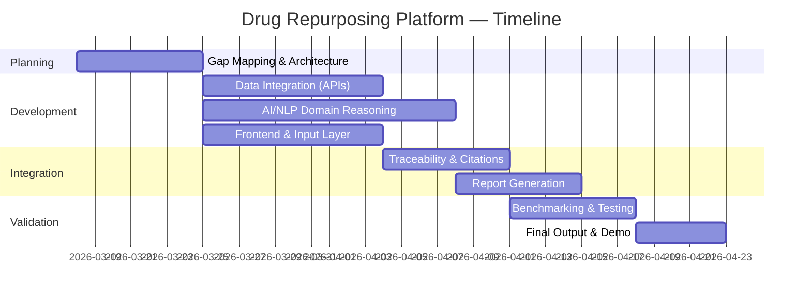

# 💊 Drug Repurposing Intelligence Platform — Implementation Plan

> **Project Goal:** Build an AI-powered platform that synthesizes fragmented clinical, patent, and regulatory data to identify novel drug-repurposing opportunities for existing molecules.

---

## 1. Architecture & System Design

The project follows a **modular multi-layer "Orchestrator"** model that coordinates specialized layers to synthesize fragmented data.

### System Layers

| Layer | Technology | Responsibility |
|-------|-----------|----------------|
| **Input Layer** | HTML, CSS, JavaScript | Web interface to accept drug molecule names |
| **Backend Orchestrator** | Flask + Task Manager | Breaks research queries into parallel sub-tasks |
| **Data Retrieval Layer** | Multi-source Connectors | Pulls from clinical, patent, and research APIs |
| **AI Analysis Layer** | OpenAI LLM + NLP Processor | Cross-domain reasoning & insight synthesis |
| **Report Generation Layer** | JSON / HTML Templates | Converts synthesized data into structured reports |

### Data Sources

- **Clinical Trials API** — Identify trial phases and outcomes
- **Research Papers API** (PubMed / PMC) — Gather scientific literature
- **Patent Databases & Web Scrapers** — Analyze legal landscape and market reports

---

## 2. Development Lifecycle (7-Step Plan)

The project execution follows these sequential stages:

### Step 1 — Gap Mapping
- Identify data fragmentation points across clinical, regulatory, and patent domains
- Document which data sources cover which categories of information

### Step 2 — Architecture Design
- Build the multi-agent coordination system
- Design the Task Manager to handle concurrent data retrieval streams

### Step 3 — Data Integration
- Establish robust API connections to clinical trials databases
- Build patent database connectors and web scrapers
- Implement data normalization and caching

### Step 4 — Model Training & Domain Reasoning
- Develop domain-specific reasoning logic for pharmacology
- Train and prompt the AI to recognize **"Repurposing Logic"** — specifically looking for therapeutic patterns that differ from a drug's original intent
- Integrate **RAG (Retrieval-Augmented Generation)** to ensure AI conclusions are grounded in actual retrieved documents

### Step 5 — Verified Traceability
- Build an automated citation engine
- Ensure every insight in the final report links to a specific source (paper, patent, or trial)

### Step 6 — Validation & Benchmarking
- Test the system against known drug-repurposing cases (e.g., Thalidomide, Sildenafil)
- Validate that AI conclusions are medically and legally accurate

### Step 7 — Output Finalization
- Generate the final structured innovation reports
- Deliver both JSON (machine-readable) and HTML (human-readable) formats

---

## 3. Core Deliverables — The Innovation Report

The platform generates a **Structured Innovation Opportunity Report** containing:

| Section | Content |
|---------|---------|
| **Clinical Status** | Current trial data, phases, and success rates |
| **Patent Landscape** | Expiration dates and legal hurdles |
| **Regulatory Status** | Existing FDA / EMA approvals |
| **Market Analysis** | Current demand and unmet medical needs |
| **Repurposing Opportunities** | Specific recommendations for new treatment uses |

---

## 4. Technical Feasibility & Scalability

### Feasibility

- **Technical:** RAG + biomedical APIs ensure AI-grounded, hallucination-resistant outputs
- **Economic:** Leverages open-source AI tools and public databases (PubMed, ClinicalTrials.gov) to keep costs low

### Scalability

- Architecture supports adding more data sources (real-world evidence, chemical property databases)
- Can upgrade to more advanced LLMs as they become available
- Module-based design allows independent scaling of each layer

---

## 5. Team Assignments (SVCE CSE — 3rd Year, 6 Members)

| Role | Members | Scope |
|------|---------|-------|
| **Backend & Task Management** | 2 | Flask server, API integrations, Task Manager |
| **AI & NLP Development** | 2 | LLM prompting, RAG logic, domain reasoning |
| **Frontend & Reporting** | 2 | Web interface, HTML report generation, UX |

---

## 6. Project Timeline (Suggested)

---

## 7. Tech Stack Summary

| Category | Tools |
|----------|-------|
| **Frontend** | HTML5, CSS3, JavaScript |
| **Backend** | Python, Flask |
| **AI/ML** | OpenAI API, LangChain (RAG) |
| **Data APIs** | PubMed API, ClinicalTrials.gov API |
| **Scraping** | BeautifulSoup / Scrapy |
| **Database** | SQLite / PostgreSQL |
| **Deployment** | Docker, Gunicorn |

---

> [!IMPORTANT]
> All AI-generated insights must include **verified source citations** linking back to original papers, patents, or trial records. This is a non-negotiable requirement for medical credibility.